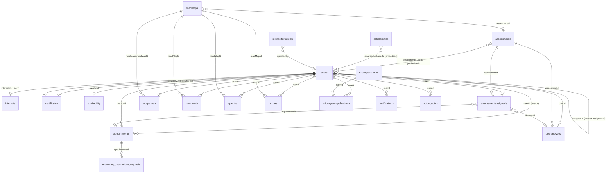

# CCC Backend — Database Schema Documentation

**Document Version:** 1.0  
**Generated:** June 30, 2026  
**Database:** MongoDB (document-oriented)  
**ODM:** Mongoose v8 via NestJS `@nestjs/mongoose`

---

## Table of Contents

1. [Database Overview](#1-database-overview)
2. [Architecture & Major Modules](#2-architecture--major-modules)
3. [Conventions & Terminology](#3-conventions--terminology)
4. [Entity Relationship Diagram](#4-entity-relationship-diagram)
5. [Collection Reference](#5-collection-reference)
6. [Special Sections](#6-special-sections)
   - [User Roles & Permissions](#61-user-roles--permissions)
   - [Audit & Log Data](#62-audit--log-data)
   - [Configuration & Master Data](#63-configuration--master-data)
7. [Relationship Summary](#7-relationship-summary)
8. [Indexes Summary](#8-indexes-summary)
9. [Assumptions & Notes](#9-assumptions--notes)

---

## 1. Database Overview

The CCC (Church Community Connection) backend stores all persistent data in **MongoDB**, a flexible document database. Data is organized into **23 collections** (analogous to tables in relational databases). Each collection holds JSON-like documents with nested structures where appropriate.

### High-Level Purpose

The database supports an end-to-end pastoral development and mentoring platform:

| Domain | Purpose |
|--------|---------|
| **Onboarding & Identity** | User accounts, role-based access, interest/applications, OTP verification |
| **Learning Paths** | Roadmaps with nested tasks, form submissions, comments, and Q&A |
| **Assessments** | Structured evaluations (CMA, PMP), assignments, and scored answers |
| **Mentoring** | Appointments, mentor availability, rescheduling, session recordings |
| **Progress Tracking** | Aggregated completion metrics across roadmaps and assessments |
| **Programs & Benefits** | Certificates, scholarships, micro-grant applications |
| **Content & Notifications** | Home dashboard data, media library, in-app notifications |
| **Voice Notes** | Audio uploads/recordings with AI transcription and summarization |

### Connection Configuration

| Setting | Source | Default |
|---------|--------|---------|
| Connection URI | Environment variable `MONGO_URI` | — |
| Database name | Environment variable `MONGO_DB_NAME` | `nest_project` |

Configuration is loaded in `src/database/database.module.ts`.

### Schema Management

There is **no formal SQL-style migration framework**. Schema shape and indexes are defined in Mongoose schema files and applied at application runtime. Ad-hoc data scripts exist in `src/scripts/` for one-time backfills (appointments, assessment progress, mentor availability seeding).

---

## 2. Architecture & Major Modules

```
┌─────────────────────────────────────────────────────────────────────────┐
│                         CCC MongoDB Database                            │
├──────────────┬──────────────┬──────────────┬──────────────┬─────────────┤
│   Identity   │   Learning   │  Mentoring   │   Programs   │   Content   │
│              │              │              │              │             │
│  users       │  roadmaps    │ appointments │ certificates │  homes      │
│  interests   │  comments    │ availability │ scholarships │  media      │
│  otptokens   │  queries     │ mentoring_   │ microgrant   │ notifications│
│              │  extras      │ reschedule_  │ forms / apps │             │
│              │  progress    │ requests     │              │             │
│              │  assessments │  voice_notes │              │             │
│              │  useranswers │              │              │             │
│              │  assessment  │              │              │             │
│              │  assigned    │              │              │             │
│              │  interest_   │              │              │             │
│              │  form_fields │              │              │             │
└──────────────┴──────────────┴──────────────┴──────────────┴─────────────┘
```

### Module-to-Collection Mapping

| Application Module | Collections |
|--------------------|-------------|
| Users | `users` |
| Auth | `otptokens` |
| Interests | `interests`, `interestformfields` |
| Home | `homes`, `notifications`, `media` |
| Appointments | `appointments`, `availability` |
| Assessment | `assessments`, `useranswers`, `assessmentassigneds` |
| Progress | `progresses` |
| Roadmaps | `roadmaps`, `comments`, `queries`, `extras` |
| Certificates | `certificates` |
| Products & Services | `scholarships` |
| Micro Grants | `micrograntforms`, `micrograntapplications` |
| Mentoring Sessions | `mentoring_reschedule_requests` |
| Voice Notes | `voice_notes` |

> **Note on collection names:** Mongoose auto-pluralizes model names unless an explicit `collection` name is set. Verify live names with `db.getCollectionNames()` if needed.

---

## 3. Conventions & Terminology

| Term | Meaning in This System |
|------|------------------------|
| **Collection / Table** | A MongoDB collection storing documents of the same schema |
| **Document** | A single record (row equivalent) |
| **Primary Key** | `_id` — auto-generated `ObjectId` on every top-level document |
| **Foreign Key** | `ObjectId` field with `ref: 'ModelName'` linking to another collection |
| **Embedded Document** | Nested object/array stored inside a parent document (not a separate collection) |
| **Nullable** | Field may be absent or `null` (Yes = optional; No = required) |
| **Timestamps** | `createdAt` and `updatedAt` added automatically when `timestamps: true` is set on a schema |

### Relationship Patterns

- **Reference:** Cross-collection links via `ObjectId` (populated at read time in application code).
- **Embedding:** Parent-child data stored in the same document (e.g., assessment sections, roadmap nested tasks).
- **Denormalization:** Some assignment data exists both embedded (`Assessment.assignments[]`) and in a separate junction collection (`assessmentassigneds`).

---

## 4. Entity Relationship Diagram



---

## 5. Collection Reference

Each section below documents one MongoDB collection. Embedded sub-documents are listed under their parent collection.

---

### 5.1 `users`

**Purpose:** Central identity store for all platform participants — pastors, mentors, directors, administrators, and applicants. Holds authentication credentials, role assignment, Google Calendar/Zoom integration, mentor assignments, and program completion flags.

| Column | Data Type | Nullable | Default | PK | FK | Unique | Notes |
|--------|-----------|----------|---------|----|----|--------|-------|
| `_id` | ObjectId | No | Auto | Yes | — | Yes | Primary key |
| `interestId` | ObjectId | Yes | — | — | `interests` | No | Links to original interest application |
| `firstName` | String | No | — | — | — | No | |
| `lastName` | String | No | — | — | — | No | |
| `email` | String | No | — | — | — | Yes | Login identifier |
| `username` | String | Yes | — | — | — | Yes (sparse) | Optional display username |
| `password` | String | Yes | — | — | — | No | Hashed password |
| `role` | String (enum) | No | `pending` | — | — | No | See [Roles](#61-user-roles--permissions) |
| `roleId` | String | No | nanoid() | — | — | Yes | Public-facing role identifier |
| `profilePicture` | String | Yes | — | — | — | No | URL to profile image |
| `status` | String (enum) | No | `pending` | — | — | No | `pending`, `accepted`, `rejected` |
| `isEmailVerified` | Boolean | No | `false` | — | — | No | |
| `emailVerifiedAt` | Date | Yes | — | — | — | No | |
| `isPasswordSet` | Boolean | No | `false` | — | — | No | |
| `passwordCreatedAt` | Date | Yes | — | — | — | No | |
| `refreshToken` | String | Yes | — | — | — | No | Session refresh token |
| `googleAccessToken` | String | Yes | — | — | — | No | Google OAuth |
| `googleRefreshToken` | String | Yes | — | — | — | No | |
| `googleTokenExpiry` | Number | Yes | — | — | — | No | Unix timestamp |
| `googleCalendarId` | String | Yes | — | — | — | No | Calendar ID for sync |
| `googleCalendarStatus` | String (enum) | Yes | `disconnected` | — | — | No | `connected`, `disconnected`, `error` |
| `googleCalendarConnectedAt` | Date | Yes | — | — | — | No | |
| `googleCalendarLastSyncAt` | Date | Yes | — | — | — | No | |
| `googleCalendarEmail` | String | Yes | — | — | — | No | |
| `googleCalendarLastError` | String | Yes | `null` | — | — | No | |
| `fcmTokens` | Array[String] | No | `[]` | — | — | No | Firebase push tokens |
| `expoTokens` | Array[String] | No | `[]` | — | — | No | Expo push tokens |
| `assignedId` | Array[ObjectId] | No | `[]` | — | `users` | No | Assigned mentor(s) |
| `uploadedDocuments` | Array[Object] | No | `[]` | — | — | No | See embedded structure below |
| `hasCompleted` | Boolean | No | `false` | — | — | No | Program completion flag |
| `completedAt` | Date | Yes | `null` | — | — | No | |
| `hasIssuedCertificate` | Boolean | No | `false` | — | — | No | |
| `fieldMentorInvitation` | Object | Yes | — | — | — | No | See embedded structure below |
| `zoomUserId` | String | Yes | `null` | — | — | No | Zoom integration ID |
| `notes` | Array[Note] | No | `[]` | — | — | No | Admin/mentor notes |
| `createdAt` | Date | No | Auto | — | — | No | Timestamp |
| `updatedAt` | Date | No | Auto | — | — | No | Timestamp |

**Embedded: `uploadedDocuments[]`**

| Field | Data Type | Nullable | Default |
|-------|-----------|----------|---------|
| `fileName` | String | No | — |
| `fileUrl` | String | No | — |
| `fileType` | String | No | — |
| `fileSize` | Number | No | — |
| `uploadedAt` | Date | No | `Date.now` |

**Embedded: `fieldMentorInvitation`**

| Field | Data Type | Nullable | FK |
|-------|-----------|----------|-----|
| `invitedBy` | ObjectId | Yes | `users` |
| `invitedAt` | Date | Yes | — |
| `token` | String | Yes | — |
| `expiresAt` | Date | Yes | — |

**Embedded: `notes[]` (Note)**

| Field | Data Type | Nullable | Default |
|-------|-----------|----------|---------|
| `_id` | ObjectId | Auto | — |
| `content` | String | No | — |
| `createdAt` | Date | No | Auto |
| `updatedAt` | Date | No | Auto |

**Indexes:** `role`, `status`, `interestId`, `createdAt` (desc), `(assignedId, status)`, text on `firstName/lastName/email/username`, `fcmTokens`, `roleId` (unique), `email` (unique), `username` (unique sparse)

---

### 5.2 `interests`

**Purpose:** Stores interest/application submissions from prospective pastors before or during account creation. Captures personal, church, and ministry details plus dynamic form field values.

| Column | Data Type | Nullable | Default | PK | FK | Unique | Notes |
|--------|-----------|----------|---------|----|----|--------|-------|
| `_id` | ObjectId | No | Auto | Yes | — | Yes | |
| `userId` | ObjectId | Yes | — | — | `users` | No | Linked after account creation |
| `profileInfo` | String | Yes | — | — | — | No | |
| `firstName` | String | No | — | — | — | No | |
| `lastName` | String | No | — | — | — | No | |
| `phoneNumber` | String | Yes* | — | — | — | No | *Not marked required in schema |
| `email` | String | No | — | — | — | Yes | |
| `createdBy` | String (enum) | No | `self` | — | — | No | `self` or `admin` |
| `profilePicture` | String | Yes | — | — | — | No | |
| `churchDetails` | Array[ChurchDetails] | No | `[]` | — | — | No | See below |
| `title` | String (enum) | No | — | — | — | No | From `TITLES_LIST` metadata |
| `conference` | String | Yes | — | — | — | No | |
| `yearsInMinistry` | String | Yes | — | — | — | No | |
| `currentCommunityProjects` | String | Yes | — | — | — | No | |
| `interests` | Array[String] | Yes | — | — | — | No | |
| `comments` | String | Yes | — | — | — | No | Applicant comments |
| `status` | String (enum) | No | `new` | — | — | No | `new`, `pending`, `accepted`, `rejected` |
| `dynamicFieldValues` | Mixed (Object) | No | `{}` | — | — | No | Key-value dynamic form answers |
| `createdAt` | Date | No | Auto | — | — | No | |
| `updatedAt` | Date | No | Auto | — | — | No | |

**Embedded: `churchDetails[]`**

| Field | Data Type | Nullable |
|-------|-----------|----------|
| `churchName` | String | No |
| `churchPhone` | String | Yes |
| `churchWebsite` | String | Yes |
| `churchAddress` | String | Yes |
| `city` | String | Yes |
| `state` | String | Yes |
| `zipCode` | String | Yes |
| `country` | String | Yes |

**Indexes:** `churchDetails.country`, `churchDetails.conference`, `userId`, `status`, `createdAt` (desc), `(churchDetails.country, churchDetails.state)`, `email`, text search on name/email/title/conference

---

### 5.3 `interestformfields`

**Purpose:** Master configuration for dynamic fields on the interest/application form. Typically maintained as a singleton document edited by administrators.

| Column | Data Type | Nullable | Default | PK | FK | Unique | Notes |
|--------|-----------|----------|---------|----|----|--------|-------|
| `_id` | ObjectId | No | Auto | Yes | — | Yes | |
| `fields` | Array[DynamicField] | No | `[]` | — | — | No | See below |
| `updatedBy` | ObjectId | Yes | — | — | `users` | No | Last editor |
| `createdAt` | Date | No | Auto | — | — | No | |
| `updatedAt` | Date | No | Auto | — | — | No | |

**Embedded: `fields[]` (DynamicField)**

| Field | Data Type | Nullable | Default |
|-------|-----------|----------|---------|
| `fieldId` | String | No | — |
| `label` | String | No | — |
| `type` | String (enum) | No | — | `text_field`, `text_area`, `checkbox`, `radio`, `select`, `email`, `phone`, `date`, `number` |
| `placeholder` | String | Yes | — |
| `required` | Boolean | No | `false` |
| `options` | Array[String] | No | `[]` |
| `order` | Number | No | `0` |
| `section` | String | Yes | — |

**Indexes:** None explicitly defined

---

### 5.4 `otptokens`

**Purpose:** Temporary one-time password tokens for email verification, password reset, and two-factor authentication. Documents auto-expire via TTL index.

| Column | Data Type | Nullable | Default | PK | FK | Unique | Notes |
|--------|-----------|----------|---------|----|----|--------|-------|
| `_id` | ObjectId | No | Auto | Yes | — | Yes | |
| `email` | String | No | — | — | — | No | |
| `otpHash` | String | No | — | — | — | No | Hashed OTP value |
| `purpose` | String | No | — | — | — | No | `email-verification`, `password-reset`, `2fa` |
| `expiresAt` | Date | No | — | — | — | No | TTL — document deleted after expiry |
| `used` | Boolean | No | `false` | — | — | No | |
| `createdAt` | Date | No | Auto | — | — | No | |
| `updatedAt` | Date | No | Auto | — | — | No | |

**Indexes:** `(email, purpose, used)`, `createdAt`, `expiresAt` (TTL, `expireAfterSeconds: 0`)

---

### 5.5 `homes`

**Purpose:** Per-user home dashboard configuration. Stores quick-reference lists (appointments, roadmaps, mentors) keyed by user email/username.

| Column | Data Type | Nullable | Default | PK | FK | Unique | Notes |
|--------|-----------|----------|---------|----|----|--------|-------|
| `_id` | ObjectId | No | Auto | Yes | — | Yes | |
| `email` | String | No | — | — | — | Yes | |
| `username` | String | No | — | — | — | No | |
| `appointments` | Array[String] | Yes | — | — | — | No | *Assumed: appointment IDs or labels |
| `roadmaps` | Array[String] | Yes | — | — | — | No | |
| `mentors` | Array[String] | Yes | — | — | — | No | |
| `createdAt` | Date | No | Auto | — | — | No | |
| `updatedAt` | Date | No | Auto | — | — | No | |

**Indexes:** `username`

---

### 5.6 `notifications`

**Purpose:** In-app notification inbox per user or role. Notifications are embedded as an array within each document.

| Column | Data Type | Nullable | Default | PK | FK | Unique | Notes |
|--------|-----------|----------|---------|----|----|--------|-------|
| `_id` | ObjectId | No | Auto | Yes | — | Yes | |
| `userId` | ObjectId | Yes | — | — | `users` | No | Target user |
| `role` | String | Yes | — | — | — | No | Role-based notifications |
| `notifications` | Array[NotificationItem] | No | `[]` | — | — | No | See below |
| `createdAt` | Date | No | Auto | — | — | No | |
| `updatedAt` | Date | No | Auto | — | — | No | |

**Embedded: `notifications[]` (NotificationItem)**

| Field | Data Type | Nullable | Default |
|-------|-----------|----------|---------|
| `name` | String | No | — |
| `details` | String | No | — |
| `module` | String | Yes | — |
| `referenceId` | String | Yes | — |
| `read` | Boolean | No | `false` |
| `createdAt` | Date | No | `Date.now` |

**Indexes:** `userId`, `role`, `notifications.read`, `createdAt`, `updatedAt` (desc)

---

### 5.7 `media`

**Purpose:** CMS-style media gallery entries with headings and attached image/video files for display on the home or content pages.

| Column | Data Type | Nullable | Default | PK | FK | Unique | Notes |
|--------|-----------|----------|---------|----|----|--------|-------|
| `_id` | ObjectId | No | Auto | Yes | — | Yes | |
| `heading` | String | No | — | — | — | No | |
| `subheading` | String | Yes | — | — | — | No | |
| `description` | String | Yes | — | — | — | No | |
| `mediaFiles` | Array[Object] | No | `[]` | — | — | No | See below |
| `createdAt` | Date | No | Auto | — | — | No | |
| `updatedAt` | Date | No | Auto | — | — | No | |

**Embedded: `mediaFiles[]`**

| Field | Data Type | Nullable | Default |
|-------|-----------|----------|---------|
| `url` | String | No | — |
| `type` | String (enum) | No | — | `image` or `video` |
| `fileName` | String | No | — |
| `uploadedAt` | Date | No | `Date.now` |
| `size` | Number | Yes | — |

**Indexes:** None explicitly defined

---

### 5.8 `appointments`

**Purpose:** Scheduled mentoring sessions between a pastor (user) and mentor. Supports online (Zoom) and in-person modes, Google Calendar sync, recording, and AI-generated transcript summaries.

| Column | Data Type | Nullable | Default | PK | FK | Unique | Notes |
|--------|-----------|----------|---------|----|----|--------|-------|
| `_id` | ObjectId | No | Auto | Yes | — | Yes | |
| `userId` | ObjectId | No | — | — | `users` | No | Pastor/participant |
| `mentorId` | ObjectId | No | — | — | `users` | No | Mentor/host |
| `meetingDate` | Date | No | — | — | — | No | Start time |
| `endTime` | Date | No | +1 hour | — | — | No | |
| `platform` | String (enum) | No | `zoom` | — | — | No | gmeet, zoom, teams, phone, in-person, calendly, other |
| `meetingLink` | String | Yes | — | — | — | No | |
| `sessionMode` | String (enum) | No | `ONLINE` | — | — | No | `ONLINE`, `IN_PERSON`, `NOT_DECIDED` |
| `recordingUrl` | String | Yes | `null` | — | — | No | |
| `recordingStatus` | String (enum) | No | `NOT_STARTED` | — | — | No | `NOT_STARTED`, `PROCESSING`, `COMPLETED`, `FAILED` |
| `meetingLocation` | String | Yes | `null` | — | — | No | In-person address |
| `notes` | String | Yes | — | — | — | No | |
| `title` | String | Yes | — | — | — | No | Meeting subject |
| `description` | String | Yes | — | — | — | No | Booking reason |
| `status` | String (enum) | No | `scheduled` | — | — | No | scheduled, in-progress, completed, missed, postponed, canceled |
| `canceledAt` | Date | Yes | `null` | — | — | No | |
| `cancelReason` | String | Yes | `null` | — | — | No | |
| `hostJoinedAt` | Date | Yes | `null` | — | — | No | First host join time |
| `joinAudit` | Array[Object] | No | `[]` | — | — | No | [Audit log](#62-audit--log-data) |
| `zoomMeetingId` | String | Yes | `null` | — | — | No | |
| `zoomMeeting` | Object | Yes | `null` | — | — | No | Zoom API response snapshot |
| `transcript` | String | Yes | `null` | — | — | No | Full session transcript |
| `transcriptSavedAt` | Date | Yes | `null` | — | — | No | |
| `transcriptSummary` | Object | Yes | `null` | — | — | No | AI summary structure |
| `transcriptSummarySavedAt` | Date | Yes | `null` | — | — | No | |
| `transcriptSummaryModel` | String | Yes | `null` | — | — | No | AI model used |
| `googleCalendarNonMentorUserId` | ObjectId | Yes | `null` | — | `users` | No | Alternate calendar participant |
| `mentorGoogleCalendarEventId` | String | Yes | `null` | — | — | No | |
| `userGoogleCalendarEventId` | String | Yes | `null` | — | — | No | |
| `createdAt` | Date | No | Auto | — | — | No | |
| `updatedAt` | Date | No | Auto | — | — | No | |

**Embedded: `joinAudit[]`**

| Field | Data Type | Nullable | FK |
|-------|-----------|----------|-----|
| `at` | Date | No | — |
| `userId` | ObjectId | No | `users` |
| `kind` | String (enum) | No | — | `host` or `participant` |

**Embedded: `zoomMeeting`**

| Field | Data Type | Nullable |
|-------|-----------|----------|
| `meetingId` | String | Yes |
| `joinUrl` | String | Yes |
| `startUrl` | String | Yes |
| `password` | String | Yes |
| `hostEmail` | String | Yes |
| `hostId` | String | Yes |
| `topic` | String | Yes |
| `duration` | Number | Yes |
| `timezone` | String | Yes |
| `createdAt` | Date | Yes |

**Embedded: `transcriptSummary`**

| Field | Data Type | Nullable | Default |
|-------|-----------|----------|---------|
| `sessionOverview` | String | Yes | `null` |
| `keyDiscussionPoints` | Array[String] | No | `[]` |
| `mentorGuidance` | Array[String] | No | `[]` |
| `actionItems` | Array[String] | No | `[]` |
| `followUp` | String | Yes | `null` |

**Indexes:** `userId`, `mentorId`, `sessionMode`, `zoomMeetingId`, `(meetingDate, endTime)`, `(userId, meetingDate)`, `(mentorId, meetingDate)`, `(status, mentorId)`, `(status, userId)`, `(status, meetingDate desc)`, `(status, endTime)`, text on platform/status/notes/title/description

---

### 5.9 `availability`

**Purpose:** Mentor scheduling configuration — weekly slots, recurring patterns, per-day overrides, and booking constraints.

| Column | Data Type | Nullable | Default | PK | FK | Unique | Notes |
|--------|-----------|----------|---------|----|----|--------|-------|
| `_id` | ObjectId | No | Auto | Yes | — | Yes | |
| `mentorId` | ObjectId | No | — | — | `users` | No | One doc per mentor (assumed) |
| `weeklySlots` | Array[DayAvailability] | No | 7 empty days | — | — | No | See below |
| `meetingDuration` | Number | No | `60` | — | — | No | Minutes |
| `minSchedulingNoticeHours` | Number | No | `2` | — | — | No | |
| `maxBookingsPerDay` | Number | No | `5` | — | — | No | |
| `preferredPlatform` | String (enum) | No | `zoom` | — | — | No | |
| `recurringWeeklyPattern` | Array[RecurringWeekdayPattern] | No | `[]` | — | — | No | UTC weekday template |
| `recurringHorizonDays` | Number | No | `60` | — | — | No | Days ahead to materialize |
| `recurringSuppressedDates` | Array[String] | No | `[]` | — | — | No | YYYY-MM-DD |
| `recurringExceptionDates` | Array[String] | No | `[]` | — | — | No | YYYY-MM-DD custom edits |
| `createdAt` | Date | No | Auto | — | — | No | |
| `updatedAt` | Date | No | Auto | — | — | No | |

**Embedded: `Slot`**

| Field | Data Type | Nullable |
|-------|-----------|----------|
| `startTime` | String | No |
| `startPeriod` | String (enum) | No | `AM` or `PM` |
| `endTime` | String | No |
| `endPeriod` | String (enum) | No | `AM` or `PM` |

**Embedded: `DayAvailability`**

| Field | Data Type | Nullable | Default |
|-------|-----------|----------|---------|
| `date` | Date | No | — |
| `rawSlots` | Array[Slot] | No | `[]` |
| `slots` | Array[Slot] | No | `[]` |
| `unavailable` | Boolean | No | `false` |
| `generation` | String (enum) | Yes | — | `recurring`, `override`, `legacy` |

**Embedded: `RecurringWeekdayPattern`**

| Field | Data Type | Nullable | Default |
|-------|-----------|----------|---------|
| `weekday` | Number | No | — | 0=Sunday … 6=Saturday |
| `rawSlots` | Array[Slot] | No | `[]` |

**Indexes:** `mentorId` (field-level index)

---

### 5.10 `assessments`

**Purpose:** Assessment templates (CMA, PMP) with multi-section layered questions, scoring recommendations, pre-survey questions, and embedded user assignments.

| Column | Data Type | Nullable | Default | PK | FK | Unique | Notes |
|--------|-----------|----------|---------|----|----|--------|-------|
| `_id` | ObjectId | No | Auto | Yes | — | Yes | |
| `name` | String | No | — | — | — | No | |
| `description` | String | No | — | — | — | No | |
| `instructions` | Array[String] | No | `[]` | — | — | No | |
| `bannerImage` | String | Yes | — | — | — | No | |
| `sections` | Array[Section] | No | `[]` | — | — | No | See below |
| `assignments` | Array[AssignTo] | No | `[]` | — | — | No | Embedded assignments |
| `type` | String (enum) | No | — | — | — | No | `CMA` or `PMP` |
| `preSurvey` | Array[PreSurveyQuestion] | Yes | — | — | — | No | |
| `createdAt` | Date | No | Auto | — | — | No | |
| `updatedAt` | Date | No | Auto | — | — | No | |

**Embedded: `Section`**

| Field | Data Type | Nullable | Default |
|-------|-----------|----------|---------|
| `_id` | ObjectId | Auto | — |
| `title` | String | No | — |
| `description` | String | No | — |
| `layers` | Array[Layer] | No | `[]` |
| `recommendations` | Array[RecommendationLevel] | No | `[]` |

**Embedded: `Layer`**

| Field | Data Type | Nullable | Default |
|-------|-----------|----------|---------|
| `_id` | ObjectId | Auto | — |
| `title` | String | No | — |
| `choices` | Array[Choice] | No | `[]` |

**Embedded: `Choice`**

| Field | Data Type | Nullable |
|-------|-----------|----------|
| `_id` | ObjectId | Auto |
| `text` | String | No |

**Embedded: `RecommendationLevel`**

| Field | Data Type | Nullable | Default |
|-------|-----------|----------|---------|
| `level` | Number | No | — |
| `items` | Array[String] | No | `[]` |

**Embedded: `PreSurveyQuestion`**

| Field | Data Type | Nullable |
|-------|-----------|----------|
| `text` | String | No |
| `type` | String (enum) | No | `text`, `number`, `date`, `select` |
| `placeholder` | String | Yes |
| `required` | Boolean | No |

**Embedded: `assignments[]` (AssignTo)**

| Field | Data Type | Nullable | Default | FK |
|-------|-----------|----------|---------|-----|
| `userId` | ObjectId | No | — | `users` |
| `assignedAt` | Date | No | `Date.now` | — |
| `completedAt` | Date | Yes | — | — |
| `status` | String (enum) | No | `assigned` | — | assigned, due, in-progress, completed |

**Indexes:** `assignments.status`, `assignments.userId + assignments.status`, `assignments.status + createdAt`, `type + createdAt`, text on name/description/type

---

### 5.11 `useranswers`

**Purpose:** Stores a user's completed assessment responses, per-section layer choices, pre-survey answers, and computed scores.

| Column | Data Type | Nullable | Default | PK | FK | Unique | Notes |
|--------|-----------|----------|---------|----|----|--------|-------|
| `_id` | ObjectId | No | Auto | Yes | — | Yes | |
| `userId` | ObjectId | No | — | — | `users` | No | |
| `assessmentId` | ObjectId | No | — | — | `assessments` | No | |
| `sections` | Array[SectionAnswer] | No | `[]` | — | — | No | See below |
| `preSurveyAnswers` | Array[Object] | No | `[]` | — | — | No | `{ questionText, answer }` |
| `preSurveySubmittedAt` | Date | Yes | — | — | — | No | |
| `overallScore` | Number | Yes | — | — | — | No | |
| `createdAt` | Date | No | Auto | — | — | No | |
| `updatedAt` | Date | No | Auto | — | — | No | |

**Embedded: `SectionAnswer`**

| Field | Data Type | Nullable | Default |
|-------|-----------|----------|---------|
| `sectionId` | ObjectId | No | — |
| `layers` | Array[LayerAnswer] | No | `[]` |
| `sectionScore` | Number | Yes | — |
| `recommendations` | Array[String] | No | `[]` |

**Embedded: `LayerAnswer`**

| Field | Data Type | Nullable | Default |
|-------|-----------|----------|---------|
| `layerId` | ObjectId | No | — |
| `selectedChoice` | String | No | — |
| `answeredAt` | Date | No | `Date.now` |

**Indexes:** `(userId, assessmentId)`, `assessmentId`, `userId`

---

### 5.12 `assessmentassigneds`

**Purpose:** Junction collection tracking assessment assignments to users with lifecycle status, due dates, and links to answers and appointments.

| Column | Data Type | Nullable | Default | PK | FK | Unique | Notes |
|--------|-----------|----------|---------|----|----|--------|-------|
| `_id` | ObjectId | No | Auto | Yes | — | Yes | |
| `assessmentId` | ObjectId | No | — | — | `assessments` | No | |
| `userId` | ObjectId | No | — | — | `users` | No | |
| `assignedAt` | Date | Yes | — | — | — | No | |
| `dueDate` | Date | Yes | — | — | — | No | |
| `status` | String (enum) | No | `assigned` | — | — | No | assigned, in_progress, in-progress, submitted, reviewed, completed |
| `startedAt` | Date | Yes | — | — | — | No | |
| `submittedAt` | Date | Yes | — | — | — | No | |
| `answerId` | ObjectId | Yes | — | — | `useranswers` | No | |
| `appointmentId` | ObjectId | Yes | — | — | `appointments` | No | |
| `createdAt` | Date | No | Auto | — | — | No | |
| `updatedAt` | Date | No | Auto | — | — | No | |

**Unique Constraint:** `(assessmentId, userId)` — one assignment record per user per assessment

**Indexes:** `userId`, `assessmentId`, `(userId, status)`, unique `(assessmentId, userId)`

---

### 5.13 `progresses`

**Purpose:** Aggregated progress dashboard per user across assigned roadmaps and assessments, including nested roadmap task progress and final review comments.

| Column | Data Type | Nullable | Default | PK | FK | Unique | Notes |
|--------|-----------|----------|---------|----|----|--------|-------|
| `_id` | ObjectId | No | Auto | Yes | — | Yes | |
| `userId` | ObjectId | No | — | — | `users` | No | One per user (assumed) |
| `roadmaps` | Array[Object] | No | — | — | — | No | See below |
| `totalRoadmaps` | Number | No | `0` | — | — | No | Computed |
| `completedRoadmaps` | Number | No | `0` | — | — | No | Computed |
| `overallRoadmapProgress` | Number | No | `0` | — | — | No | Percentage |
| `assessments` | Array[Object] | No | — | — | — | No | See below |
| `totalAssessments` | Number | No | `0` | — | — | No | Computed |
| `completedAssessments` | Number | No | `0` | — | — | No | Computed |
| `overallAssessmentProgress` | Number | No | `0` | — | — | No | Percentage |
| `totalItems` | Number | No | `0` | — | — | No | Computed |
| `completedItems` | Number | No | `0` | — | — | No | Computed |
| `overallProgress` | Number | No | `0` | — | — | No | Combined percentage |
| `overallCompleted` | Boolean | No | `false` | — | — | No | |
| `finalComments` | Array[Object] | No | — | — | — | No | See below |
| `createdAt` | Date | No | Auto | — | — | No | |
| `updatedAt` | Date | No | Auto | — | — | No | |

**Embedded: `roadmaps[]`**

| Field | Data Type | Nullable | Default | FK |
|-------|-----------|----------|---------|-----|
| `roadMapId` | ObjectId | No | — | `roadmaps` |
| `completedSteps` | Number | No | `0` | — |
| `totalSteps` | Number | No | `0` | — |
| `progressPercentage` | Number | No | `0` | — |
| `status` | String (enum) | No | `not_started` | — |
| `assignedAt` | Date | No | `Date.now` | — |
| `assignedBy` | ObjectId | Yes | `null` | `users` |
| `dueDate` | Date | Yes | `null` | — |
| `nestedRoadmaps` | Array[Object] | No | `[]` | See below |

**Embedded: `roadmaps[].nestedRoadmaps[]`**

| Field | Data Type | Nullable | Default |
|-------|-----------|----------|---------|
| `nestedRoadmapId` | ObjectId | No | — |
| `completedSteps` | Number | No | `0` |
| `totalSteps` | Number | No | `0` |
| `progressPercentage` | Number | No | `0` |
| `status` | String (enum) | No | `not_started` |

**Embedded: `assessments[]`**

| Field | Data Type | Nullable | Default | FK |
|-------|-----------|----------|---------|-----|
| `assessmentId` | ObjectId | No | — | `assessments` |
| `completedSections` | Number | No | `0` | — |
| `totalSections` | Number | No | `0` | — |
| `progressPercentage` | Number | No | `0` | — |
| `status` | String (enum) | No | `not_started` | — |

**Embedded: `finalComments[]`**

| Field | Data Type | Nullable | Default | FK |
|-------|-----------|----------|---------|-----|
| `commentorId` | ObjectId | No | — | `users` |
| `comment` | String | No | — | — |
| `createdAt` | Date | No | `Date.now` | — |
| `updatedAt` | Date | No | `Date.now` | — |

**Progress status values:** `not_started`, `due`, `in_progress`, `submitted`, `completed`

**Indexes:** `userId`, `(userId, roadmaps.roadMapId)`, `(userId, assessments.assessmentId)`, `(userId, roadmaps.roadMapId, roadmaps.nestedRoadmaps.nestedRoadmapId)`, `roadmaps.roadMapId`, `createdAt`, `updatedAt` (desc), `(userId, finalComments.createdAt desc)`, `roadmaps.assignedBy`, `roadmaps.dueDate`

---

### 5.14 `roadmaps`

**Purpose:** Master roadmap templates and library. Each roadmap can contain nested sub-roadmaps (tasks/phases) with dynamic form fields (extras), optional linked assessments, and display ordering.

| Column | Data Type | Nullable | Default | PK | FK | Unique | Notes |
|--------|-----------|----------|---------|----|----|--------|-------|
| `_id` | ObjectId | No | Auto | Yes | — | Yes | |
| `type` | String | No | — | — | — | No | Roadmap category/type |
| `name` | String | No | — | — | — | No | |
| `roadMapDetails` | String | Yes | — | — | — | No | |
| `description` | String | Yes | — | — | — | No | |
| `status` | String (enum) | No | `not started` | — | — | No | not started, in progress, completed |
| `duration` | String | No | — | — | — | No | e.g. "12 weeks" |
| `startDate` | Date | Yes | — | — | — | No | |
| `endDate` | Date | Yes | — | — | — | No | |
| `completedOn` | Date | Yes | — | — | — | No | |
| `imageUrl` | String | Yes | — | — | — | No | |
| `meetings` | Array[Date] | No | `[]` | — | — | No | Scheduled meeting dates |
| `divisions` | Array[String] | No | `[]` | — | — | No | Organizational divisions |
| `haveNextedRoadMaps` | Boolean | No | `false` | — | — | No | Auto-set if nested roadmaps exist |
| `phase` | String | No | `""` | — | — | No | |
| `assesmentId` | ObjectId | Yes | — | — | `assessments` | No | *Typo in schema field name |
| `totalSteps` | Number | No | `0` | — | — | No | |
| `extras` | Array[Mixed] | No | `[]` | — | — | No | Polymorphic form fields |
| `roadmaps` | Array[NestedRoadMapItem] | No | `[]` | — | — | No | Nested tasks |
| `displayOrder` | Number | Yes | — | — | — | No | Director library sort (1-based) |
| `createdAt` | Date | No | Auto | — | — | No | |
| `updatedAt` | Date | No | Auto | — | — | No | |

**Embedded: `roadmaps[]` (NestedRoadMapItem)**

| Field | Data Type | Nullable | Default |
|-------|-----------|----------|---------|
| `_id` | ObjectId | Auto | — |
| `name` | String | No | — |
| `roadMapDetails` | String | Yes | — |
| `description` | String | Yes | — |
| `status` | String (enum) | No | `not started` |
| `duration` | String | No | — |
| `startDate` | Date | Yes | — |
| `endDate` | Date | Yes | — |
| `completedOn` | Date | Yes | — |
| `imageUrl` | String | Yes | — |
| `meetings` | Array[Date] | No | `[]` |
| `phase` | String | No | `""` |
| `totalSteps` | Number | No | `0` |
| `extras` | Array[Mixed] | No | `[]` |

**Embedded extra field types** (stored in `extras` as discriminated objects): `TEXT_FIELD`, `TEXT_AREA`, `TEXT_DISPLAY`, `CHECKBOX`, `UPLOAD`, `DATE_PICKER`, `ASSESSMENT`, `SECTION`, `SIGNATURE`

**Indexes:** text on name/description/roadMapDetails, `(status, createdAt desc)`, `(type, status)`, `(displayOrder, createdAt)`

---

### 5.15 `comments`

**Purpose:** Mentor comments on a user's roadmap progress, optionally scoped to a specific nested roadmap task.

| Column | Data Type | Nullable | Default | PK | FK | Unique | Notes |
|--------|-----------|----------|---------|----|----|--------|-------|
| `_id` | ObjectId | No | Auto | Yes | — | Yes | |
| `userId` | ObjectId | No | — | — | `users` | No | Pastor being commented on |
| `roadMapId` | ObjectId | No | — | — | `roadmaps` | No | |
| `comments` | Array[CommentItem] | No | `[]` | — | — | No | See below |
| `createdAt` | Date | No | Auto | — | — | No | |
| `updatedAt` | Date | No | Auto | — | — | No | |

**Embedded: `comments[]` (CommentItem)**

| Field | Data Type | Nullable | Default | FK |
|-------|-----------|----------|---------|-----|
| `_id` | ObjectId | Auto | — | — |
| `mentorId` | ObjectId | No | — | `users` |
| `text` | String | No | — | — |
| `nestedRoadMapItemId` | ObjectId | Yes | `null` | — |
| `addedDate` | Date | No | `Date.now` | — |

**Indexes:** `(userId, roadMapId)`, `roadMapId`, `userId`, `createdAt`, `updatedAt` (desc)

---

### 5.16 `queries`

**Purpose:** Q&A threads between pastors and mentors on roadmap content. Each document holds multiple query items with reply tracking.

| Column | Data Type | Nullable | Default | PK | FK | Unique | Notes |
|--------|-----------|----------|---------|----|----|--------|-------|
| `_id` | ObjectId | No | Auto | Yes | — | Yes | |
| `userId` | ObjectId | No | — | — | `users` | No | Pastor asking |
| `roadMapId` | ObjectId | No | — | — | `roadmaps` | No | |
| `queries` | Array[QueryItem] | No | `[]` | — | — | No | See below |
| `createdAt` | Date | No | Auto | — | — | No | |
| `updatedAt` | Date | No | Auto | — | — | No | |

**Embedded: `queries[]` (QueryItem)**

| Field | Data Type | Nullable | Default | FK |
|-------|-----------|----------|---------|-----|
| `_id` | ObjectId | Auto | — | — |
| `actualQueryText` | String | No | — | — |
| `createdDate` | Date | No | `Date.now` | — |
| `repliedAnswer` | String | Yes | — | — |
| `repliedDate` | Date | Yes | — | — |
| `repliedMentorId` | ObjectId | Yes | — | `users` |
| `status` | String (enum) | No | `pending` | — | `pending`, `answered` |
| `nestedRoadMapItemId` | ObjectId | Yes | — | — |

**Indexes:** `(userId, roadMapId)`, `roadMapId`, `userId`, `queries.status`, `createdAt`, `updatedAt` (desc)

---

### 5.17 `extras`

**Purpose:** Pastor-submitted form responses and uploaded documents for roadmap tasks. Supports resubmission tracking with versioned upload batches.

| Column | Data Type | Nullable | Default | PK | FK | Unique | Notes |
|--------|-----------|----------|---------|----|----|--------|-------|
| `_id` | ObjectId | No | Auto | Yes | — | Yes | |
| `userId` | ObjectId | No | — | — | `users` | No | |
| `roadMapId` | ObjectId | No | — | — | `roadmaps` | No | |
| `nestedRoadMapItemId` | ObjectId | Yes | — | — | NestedRoadMapItem* | No | *Ref only; embedded in roadmaps |
| `extras` | Array[Mixed] | No | `[]` | — | — | No | Form field answers |
| `uploadedDocuments` | Array[Object] | No | `[]` | — | — | No | See below |
| `isResubmitted` | Boolean | No | `false` | — | — | No | |
| `submittedAt` | Date | Yes | `null` | — | — | No | First submission |
| `resubmittedAt` | Date | Yes | `null` | — | — | No | |
| `submissionNumber` | Number | No | `1` | — | — | No | Increments on resubmit |
| `createdAt` | Date | No | Auto | — | — | No | |
| `updatedAt` | Date | No | Auto | — | — | No | |

**Unique Constraint:** `(userId, roadMapId, nestedRoadMapItemId)` — one submission scope per user/roadmap/task

**Embedded: `uploadedDocuments[]`**

| Field | Data Type | Nullable | Default |
|-------|-----------|----------|---------|
| `uploadBatchId` | String | No | — |
| `uploadedAt` | Date | No | `Date.now` |
| `name` | String | Yes | — |
| `historyVersion` | Number | Yes | — |
| `files` | Array[Object] | No | — |

**Embedded: `files[]`**

| Field | Data Type | Nullable |
|-------|-----------|----------|
| `fileName` | String | No |
| `fileUrl` | String | No |
| `fileType` | String | No |
| `fileSize` | Number | No |

**Indexes:** `(userId, roadMapId)`, unique `(userId, roadMapId, nestedRoadMapItemId)`, `(isResubmitted, userId)`, `(userId, submittedAt)`, `(userId, resubmittedAt)`, field-level indexes on `userId` and `roadMapId`

---

### 5.18 `certificates`

**Purpose:** Issued completion certificates for pastors who finish the program. One certificate per user.

| Column | Data Type | Nullable | Default | PK | FK | Unique | Notes |
|--------|-----------|----------|---------|----|----|--------|-------|
| `_id` | ObjectId | No | Auto | Yes | — | Yes | |
| `certificateId` | String | No | — | — | — | Yes | Public certificate identifier |
| `userId` | ObjectId | No | — | — | `users` | Yes | One per pastor |
| `issuedBy` | ObjectId | No | — | — | `users` | No | Issuing director/admin |
| `issuedByName` | String | No | — | — | — | No | Denormalized name |
| `pastorName` | String | No | — | — | — | No | |
| `mentorName` | String | Yes | `null` | — | — | No | |
| `programName` | String | No | — | — | — | No | |
| `completionDate` | Date | No | — | — | — | No | |
| `issuedAt` | Date | No | — | — | — | No | |
| `personalMessage` | String | Yes | `null` | — | — | No | |
| `certificateUrl` | String | Yes | `null` | — | — | No | Rendered image URL |
| `pdfUrl` | String | No | — | — | — | No | PDF download URL |
| `createdAt` | Date | No | Auto | — | — | No | |
| `updatedAt` | Date | No | Auto | — | — | No | |

**Indexes:** `certificateId` (unique), `userId` (unique), `(userId, issuedAt desc)`

---

### 5.19 `scholarships`

**Purpose:** Scholarship program definitions and awarded user records. Supports multiple scholarship types with per-recipient tracking.

| Column | Data Type | Nullable | Default | PK | FK | Unique | Notes |
|--------|-----------|----------|---------|----|----|--------|-------|
| `_id` | ObjectId | No | Auto | Yes | — | Yes | |
| `type` | String | No | — | — | — | Yes | e.g. Full scholarship, Partial Scholarship |
| `amount` | Number | No | — | — | — | No | Per-award amount |
| `description` | String | Yes | — | — | — | No | |
| `status` | String (enum) | No | `active` | — | — | No | active, inactive, suspended |
| `awardedList` | Array[AwardedUser] | No | `[]` | — | — | No | See below |
| `createdAt` | Date | No | Auto | — | — | No | |
| `updatedAt` | Date | No | Auto | — | — | No | |

**Virtual fields (computed, not stored):** `numberOfAwards`, `totalAmount`

**Embedded: `awardedList[]` (AwardedUser)**

| Field | Data Type | Nullable | Default | FK |
|-------|-----------|----------|---------|-----|
| `userId` | ObjectId | No | — | `users` |
| `awardedDate` | Date | No | — | — |
| `notes` | String | Yes | — | — |
| `academicYear` | String | Yes | — | — |
| `awardStatus` | String (enum) | No | `active` | — | active, completed, revoked |

**Indexes:** `status`, `(type, status)`, `awardedList.userId`, `createdAt`, `updatedAt` (desc), text on type/description

---

### 5.20 `micrograntforms`

**Purpose:** Master templates for micro-grant application forms with configurable sections and fields.

| Column | Data Type | Nullable | Default | PK | FK | Unique | Notes |
|--------|-----------|----------|---------|----|----|--------|-------|
| `_id` | ObjectId | No | Auto | Yes | — | Yes | |
| `title` | String | No | — | — | — | No | |
| `description` | String | Yes | `""` | — | — | No | |
| `sections` | Array[Object] | No | `[]` | — | — | No | See below |
| `createdAt` | Date | No | Auto | — | — | No | |
| `updatedAt` | Date | No | Auto | — | — | No | |

**Embedded: `sections[]`**

| Field | Data Type | Nullable | Default |
|-------|-----------|----------|---------|
| `section_title` | String | No | — |
| `section_intro` | String | No | `""` |
| `reportingProcedure` | String | No | `""` |
| `fields` | Array[Object] | No | — |

**Embedded: `sections[].fields[]`**

| Field | Data Type | Nullable | Default |
|-------|-----------|----------|---------|
| `label` | String | No | — |
| `type` | String | No | — |
| `description` | String | No | `""` |
| `placeholder` | String | No | `""` |
| `required` | Boolean | No | `false` |
| `options` | Array[String] | No | `[]` |

**Indexes:** `createdAt` (desc), `updatedAt` (desc)

---

### 5.21 `micrograntapplications`

**Purpose:** User-submitted micro-grant applications referencing a form template, with dynamic answers and supporting documents.

| Column | Data Type | Nullable | Default | PK | FK | Unique | Notes |
|--------|-----------|----------|---------|----|----|--------|-------|
| `_id` | ObjectId | No | Auto | Yes | — | Yes | |
| `userId` | ObjectId | No | — | — | `users` | No | Applicant |
| `formId` | ObjectId | No | — | — | `micrograntforms` | No | |
| `answers` | Object | No | `{}` | — | — | No | Key-value form responses |
| `supportingDocs` | Array[String] | No | `[]` | — | — | No | Document URLs |
| `status` | String (enum) | No | `new` | — | — | No | new, pending, accepted, rejected |
| `createdAt` | Date | No | Auto | — | — | No | |
| `updatedAt` | Date | No | Auto | — | — | No | |

**Indexes:** `userId`, `formId`, `status`, `(userId, status)`, `createdAt` (desc), `updatedAt` (desc)

---

### 5.22 `mentoring_reschedule_requests`

**Purpose:** Tracks pastor-initiated requests to reschedule mentoring sessions, pending mentor action.

| Column | Data Type | Nullable | Default | PK | FK | Unique | Notes |
|--------|-----------|----------|---------|----|----|--------|-------|
| `_id` | ObjectId | No | Auto | Yes | — | Yes | |
| `appointmentId` | ObjectId | No | — | — | `appointments` | No | |
| `pastorId` | ObjectId | No | — | — | `users` | No | |
| `mentorId` | ObjectId | No | — | — | `users` | No | |
| `sessionNumber` | Number | No | — | — | — | No | Session sequence in program |
| `reason` | String | Yes | — | — | — | No | |
| `status` | String (enum) | No | `pending` | — | — | No | pending, applied, dismissed |
| `createdAt` | Date | No | Auto | — | — | No | |
| `updatedAt` | Date | No | Auto | — | — | No | |

**Indexes:** `appointmentId`, `mentorId`, `(mentorId, status)`, `(pastorId, appointmentId)`

---

### 5.23 `voice_notes`

**Purpose:** User-uploaded or recorded voice notes with asynchronous AI transcription and structured summarization.

| Column | Data Type | Nullable | Default | PK | FK | Unique | Notes |
|--------|-----------|----------|---------|----|----|--------|-------|
| `_id` | ObjectId | No | Auto | Yes | — | Yes | |
| `userId` | ObjectId | No | — | — | `users` | No | |
| `title` | String | No | `""` | — | — | No | |
| `source` | String (enum) | No | `upload` | — | — | No | `upload` or `recording` |
| `audioUrl` | String | No | — | — | — | No | Storage URL |
| `audioMimeType` | String | No | — | — | — | No | |
| `fileSizeBytes` | Number | No | — | — | — | No | |
| `recordingDurationSeconds` | Number | Yes | `null` | — | — | No | |
| `recordingDeviceType` | String | Yes | `null` | — | — | No | |
| `recordingPlatform` | String | Yes | `null` | — | — | No | ios, android, web |
| `status` | String (enum) | No | `pending` | — | — | No | pending, transcribing, summarizing, completed, failed |
| `transcript` | String | Yes | `null` | — | — | No | |
| `transcriptSavedAt` | Date | Yes | `null` | — | — | No | |
| `transcriptSummary` | Object | Yes | `null` | — | — | No | Same structure as appointments |
| `transcriptSummarySavedAt` | Date | Yes | `null` | — | — | No | |
| `transcriptSummaryModel` | String | Yes | `null` | — | — | No | |
| `errorMessage` | String | Yes | `null` | — | — | No | Processing failure reason |
| `createdAt` | Date | No | Auto | — | — | No | |
| `updatedAt` | Date | No | Auto | — | — | No | |

**Indexes:** `userId`, `status`, `(userId, createdAt desc)`

---

## 6. Special Sections

### 6.1 User Roles & Permissions

The platform uses **role-based access control** stored directly on the `users` collection. There is no separate permissions or roles table — authorization is enforced in application code using role hierarchy.

#### Role Definitions (`users.role`)

| Role Value | Description (Assumed) |
|------------|----------------------|
| `pending` | New user awaiting approval/onboarding |
| `pastor` | Primary program participant |
| `mentor` | Assigned mentor providing guidance |
| `field mentor` | Field-based mentor variant |
| `lay leader` | Lay leadership role |
| `seminarian` | Seminary student participant |
| `director` | Program director with administrative access |
| `super admin` | Full system administrator |

#### Role Hierarchy (ascending privilege)

`pending` → `pastor` → `mentor` → `field mentor` → `lay leader` → `seminarian` → `director` → `super admin`

#### Related Permission Fields

| Collection | Field | Purpose |
|------------|-------|---------|
| `users` | `role` | Primary role assignment |
| `users` | `roleId` | Unique public identifier for role-related operations |
| `users` | `status` | Account approval: `pending`, `accepted`, `rejected` |
| `users` | `assignedId[]` | Mentor-to-pastor assignment list |
| `users` | `fieldMentorInvitation` | Pending field mentor invite token |
| `notifications` | `role` | Role-targeted notification delivery |
| `homes` | `email`, `username` | Dashboard access keyed to identity |

#### Host Roles (meeting hosts)

Roles that can host sessions: `mentor`, `field mentor`, `director`, `super admin`

---

### 6.2 Audit & Log Data

The system does not use a dedicated audit log collection. Audit-related data is embedded within operational collections:

| Location | Field | Type | Purpose |
|----------|-------|------|---------|
| `appointments` | `joinAudit[]` | Append-only array | Records each session join event (timestamp, user, host/participant) |
| `appointments` | `hostJoinedAt` | Date | First host join timestamp |
| `appointments` | `transcript`, `transcriptSummary` | String/Object | Session content audit trail |
| `voice_notes` | `transcript`, `transcriptSummary`, `errorMessage` | String/Object | Processing audit trail |
| `extras` | `uploadedDocuments[]`, `submissionNumber` | Array/Number | Versioned document submission history |
| `extras` | `submittedAt`, `resubmittedAt` | Date | Submission timeline |
| `otptokens` | `used`, `expiresAt` | Boolean/Date | OTP usage tracking with auto-expiry |
| `users` | `notes[]` | Array | Administrative notes on user records |
| `progresses` | `finalComments[]` | Array | Review comments with author and timestamps |
| All collections | `createdAt`, `updatedAt` | Date | Standard document lifecycle timestamps |

---

### 6.3 Configuration & Master Data

These collections store system-wide or template configuration rather than per-user transactional data:

| Collection | Purpose | Cardinality (Assumed) |
|------------|---------|----------------------|
| `interestformfields` | Dynamic interest application form definition | Singleton |
| `roadmaps` | Roadmap template library | Many (master templates) |
| `assessments` | Assessment templates (CMA, PMP) | Few |
| `micrograntforms` | Micro-grant form templates | Few |
| `scholarships` | Scholarship type definitions | Few |
| `media` | Content/media gallery entries | Many |
| `homes` | Per-user dashboard configuration | One per user |

#### Reference Data (Application Constants, Not Stored in DB)

| Constant | Values |
|----------|--------|
| Assessment types | `CMA`, `PMP` |
| Scholarship types | Full scholarship, Partial Scholarship, Full Cost, Half Scholarship, ADRA Discount |
| OTP purposes | `email-verification`, `password-reset`, `2fa` |
| Appointment platforms | gmeet, zoom, teams, phone, in-person, calendly, other |
| Session modes | `ONLINE`, `IN_PERSON`, `NOT_DECIDED` |

---

## 7. Relationship Summary

### One-to-One

| Parent | Child | Link | Notes |
|--------|-------|------|-------|
| `users` | `certificates` | `certificates.userId` (unique) | One certificate per pastor |
| `users` | `interests` | `users.interestId` ↔ `interests.userId` | Bidirectional optional link |
| `users` | `progresses` | `progresses.userId` | One progress document per user (assumed) |
| `users` | `availability` | `availability.mentorId` | One availability config per mentor (assumed) |

### One-to-Many

| Parent | Child | Foreign Key | Notes |
|--------|-------|-------------|-------|
| `users` | `appointments` | `userId` (pastor), `mentorId` | Dual role references |
| `users` | `useranswers` | `userId` | |
| `users` | `assessmentassigneds` | `userId` | |
| `users` | `comments` | `userId` | Pastor being commented on |
| `users` | `queries` | `userId` | Pastor asking questions |
| `users` | `extras` | `userId` | Form submissions |
| `users` | `micrograntapplications` | `userId` | |
| `users` | `notifications` | `userId` | |
| `users` | `voice_notes` | `userId` | |
| `roadmaps` | `comments` | `roadMapId` | |
| `roadmaps` | `queries` | `roadMapId` | |
| `roadmaps` | `extras` | `roadMapId` | |
| `assessments` | `useranswers` | `assessmentId` | |
| `assessments` | `assessmentassigneds` | `assessmentId` | |
| `micrograntforms` | `micrograntapplications` | `formId` | |
| `appointments` | `mentoring_reschedule_requests` | `appointmentId` | |

### Many-to-Many

| Entity A | Entity B | Junction Mechanism |
|----------|----------|-------------------|
| `users` (mentors) | `users` (pastors) | `users.assignedId[]` array on pastor |
| `users` | `assessments` | `assessmentassigneds` collection + `assessments.assignments[]` embedded |
| `users` | `roadmaps` | `progresses.roadmaps[]` embedded array |
| `users` | `scholarships` | `scholarships.awardedList[]` embedded array |

---

## 8. Indexes Summary

| Collection | Index Type | Fields |
|------------|------------|--------|
| `users` | Single | `role`, `status`, `interestId`, `createdAt` (desc), `fcmTokens`, `roleId` |
| `users` | Compound | `(assignedId, status)` |
| `users` | Unique | `email`, `username` (sparse), `roleId` |
| `users` | Text | `firstName`, `lastName`, `email`, `username` |
| `interests` | Single | `userId`, `status`, `createdAt` (desc), `email`, `churchDetails.country`, `churchDetails.conference` |
| `interests` | Compound | `(churchDetails.country, churchDetails.state)` |
| `interests` | Unique | `email` |
| `interests` | Text | `firstName`, `lastName`, `email`, `title`, `conference` |
| `otptokens` | Compound | `(email, purpose, used)` |
| `otptokens` | TTL | `expiresAt` (auto-delete) |
| `homes` | Single | `username` |
| `homes` | Unique | `email` |
| `notifications` | Single | `userId`, `role`, `notifications.read`, `createdAt`, `updatedAt` (desc) |
| `appointments` | Single | `userId`, `mentorId`, `sessionMode`, `zoomMeetingId` |
| `appointments` | Compound | `(meetingDate, endTime)`, `(userId, meetingDate)`, `(mentorId, meetingDate)`, `(status, mentorId)`, `(status, userId)`, `(status, meetingDate desc)`, `(status, endTime)` |
| `appointments` | Text | `platform`, `status`, `notes`, `title`, `description` |
| `availability` | Single | `mentorId` |
| `assessments` | Single | `assignments.status`, `createdAt` (desc) |
| `assessments` | Compound | `(assignments.userId, assignments.status)`, `(assignments.status, createdAt)`, `(type, createdAt)` |
| `assessments` | Text | `name`, `description`, `type` |
| `useranswers` | Compound | `(userId, assessmentId)` |
| `useranswers` | Single | `assessmentId`, `userId` |
| `assessmentassigneds` | Unique | `(assessmentId, userId)` |
| `assessmentassigneds` | Compound | `(userId, status)` |
| `assessmentassigneds` | Single | `userId`, `assessmentId` |
| `progresses` | Single | `userId`, `roadmaps.roadMapId`, `createdAt`, `updatedAt` (desc), `roadmaps.assignedBy`, `roadmaps.dueDate` |
| `progresses` | Compound | `(userId, roadmaps.roadMapId)`, `(userId, assessments.assessmentId)`, `(userId, roadmaps.roadMapId, roadmaps.nestedRoadmaps.nestedRoadmapId)`, `(userId, finalComments.createdAt desc)` |
| `roadmaps` | Compound | `(status, createdAt desc)`, `(type, status)`, `(displayOrder, createdAt)` |
| `roadmaps` | Text | `name`, `description`, `roadMapDetails` |
| `comments` | Compound | `(userId, roadMapId)` |
| `comments` | Single | `roadMapId`, `userId`, `createdAt`, `updatedAt` (desc) |
| `queries` | Compound | `(userId, roadMapId)` |
| `queries` | Single | `roadMapId`, `userId`, `queries.status`, `createdAt`, `updatedAt` (desc) |
| `extras` | Unique | `(userId, roadMapId, nestedRoadMapItemId)` |
| `extras` | Compound | `(userId, roadMapId)`, `(isResubmitted, userId)`, `(userId, submittedAt)`, `(userId, resubmittedAt)` |
| `certificates` | Unique | `certificateId`, `userId` |
| `certificates` | Compound | `(userId, issuedAt desc)` |
| `scholarships` | Unique | `type` |
| `scholarships` | Compound | `(type, status)` |
| `scholarships` | Single | `status`, `awardedList.userId`, `createdAt`, `updatedAt` (desc) |
| `scholarships` | Text | `type`, `description` |
| `micrograntforms` | Single | `createdAt` (desc), `updatedAt` (desc) |
| `micrograntapplications` | Compound | `(userId, status)` |
| `micrograntapplications` | Single | `userId`, `formId`, `status`, `createdAt` (desc), `updatedAt` (desc) |
| `mentoring_reschedule_requests` | Compound | `(mentorId, status)`, `(pastorId, appointmentId)` |
| `mentoring_reschedule_requests` | Single | `appointmentId`, `mentorId` |
| `voice_notes` | Compound | `(userId, createdAt desc)` |
| `voice_notes` | Single | `userId`, `status` |

---

## 9. Assumptions & Notes

The following items were inferred from naming conventions and code references where explicit documentation was not present:

| Item | Assumption |
|------|------------|
| `homes.appointments`, `roadmaps`, `mentors` | String arrays storing IDs or display labels for dashboard quick links |
| `progresses` cardinality | One document per user (no unique index enforced, but application logic treats it as 1:1) |
| `availability` cardinality | One document per mentor |
| `interestformfields` cardinality | Singleton configuration document |
| `roadmaps.assesmentId` | Intentional typo in schema; links to `assessments` collection |
| `extras.nestedRoadMapItemId` ref | References `_id` of embedded `NestedRoadMapItem` within a roadmap document |
| `Assessment` index on `userAnswers.userId` | Appears to reference a field not present on Assessment documents; may be legacy |
| `RoadmapAppointments` sub-schema | Defined in code but not directly embedded in `RoadMap`; may be used within `Mixed` extras or is legacy |
| Collection name pluralization | Mongoose defaults (e.g., `assessmentassigneds`, `progresses`) unless `collection` is explicitly set |
| `media` collection | No indexes defined; low-volume content expected |
| Role permissions | Enforced in application layer, not database constraints |
| Password and token fields | Stored hashed/encrypted by application logic (not enforced at schema level) |

---

## Document Information

| Property | Value |
|----------|-------|
| Source codebase | CCC-Backend (NestJS) |
| Schema files analyzed | 23 files in `src/modules/**/schemas/` |
| Migration scripts | 3 ad-hoc scripts in `src/scripts/` |
| Database type | MongoDB (document store) |

*This document describes the database schema only. It does not cover API endpoints, business logic, or service-layer behavior.*
